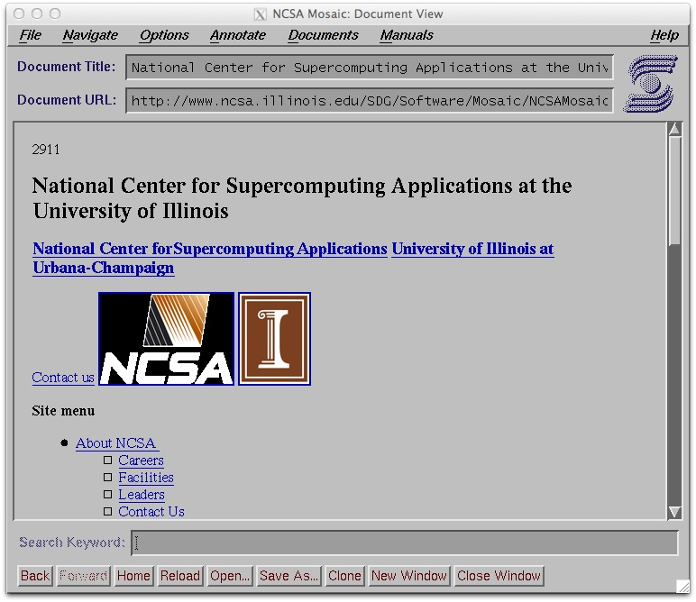
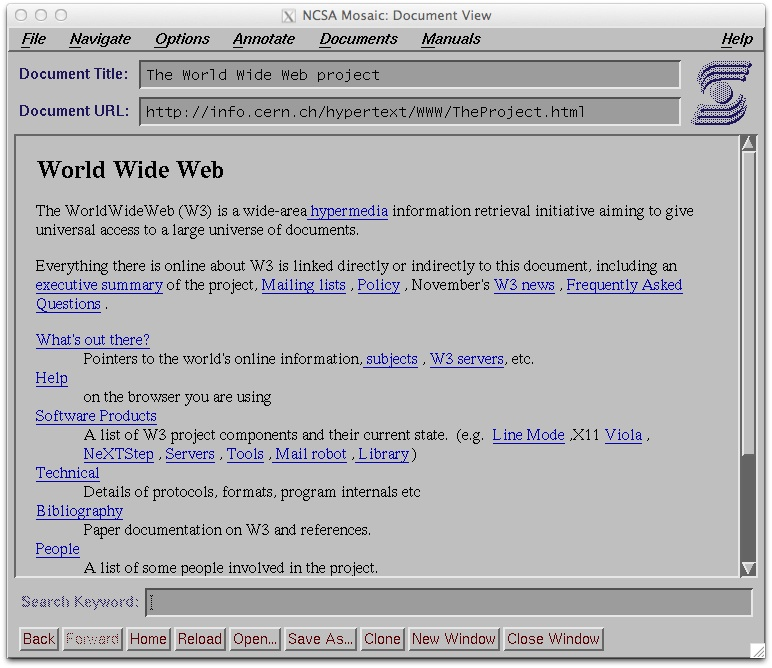

# ``xmosaic-1.2``

I took a few hours, downloaded ``xmosaic-1.2`` and got it working on Max OS X as part
of an article I was writing - the code is here in case you want to experience what the
web was like in 1993 :)

## Demonstration

Here is a [YouTube Video](http://www.youtube.com/watch?v=bxx528av7ns) demonstrating the 
application.

## Building ``xmosaic``

The ``xmosaic-1.2`` package can be built on a growing number of platforms, but each has its own
pre-requisites and dependencies. On all platforms, you will need a C compiler such as gcc.

### Pre-requisites by platform

#### Ubuntu Linux

Install the required dependencies before building:

	$ apt-get install build-essential libxmu-dev libxmu-headers libxpm-dev libmotif-dev imagemagick

##### Vagrant setup for Ubuntu Linux

	$ vagrant up
	$ vagrant ssh -- -X
	$ cd /vagrant/
	$ make linux
	$ cd src
	$ ./xmosaic

#### Mac OS X (10.6+)

On <b>10.8 and later</b>, download and install XQuartz:

	http://xquartz.macosforge.org/landing/

On all versions, download and install OpenMotif:

	http://www.ist-inc.com/motif/download/index.html

OpenMotif installs into ``/usr/OpenMotif``

#### Solaris 9 (32-bit)

The following Solaris packages need to be installed:

	SUNWxwice (X Window System Inter-Client Exchange (ICE) Components)
	SUNWxwplt (X Window System platform software)
	SUNWxwrtl (X Window System & Graphics Runtime Library Links in /usr/lib)

### Compiling the code

A top-level Makefile with platform targets is provided and recommended for all builds:

	$ make linux     # Build for Linux
	$ make osx       # Build for Mac OS X
	$ make solaris9  # Build for Solaris 9

The original NCSA ``README`` and the subsidiary ``Makefiles`` provide more details.

To start ``xmosaic``:

	$ cd src
	$ ./xmosaic &

## Pre-built binaries

Here is a compiled [Binary Macintosh Distribution](https://github.com/csev/xmosaic-1.2/blob/master/XMosaic.zip?raw=true) 
that should work on Max OS X 10.6 or later (with the pre-requisites installed).

I am *not* an expert in Mac OS X application distribution so I don't have 
any kind of one-click installer simply because I don't have the skills to 
make such an installer.

## Changes from original NCSA release

I have made very few changes to let it browse a bit more of the web
reasonably:

* It uses HTTP/1.1 instead of HTTP 1.0 so it can see virtual hosted sites

* It uses sips for OS X to convert all images to gif to give best chance of seeing them. Under Linux it uses imagemagick.

* It ignores ampersand hex values as those were not invented yet

* It hides content between script and style tags as those were not invented yet

It also is pretty chatty in the console while it is running - I am still 
working on the code and want to see if it breaks.

