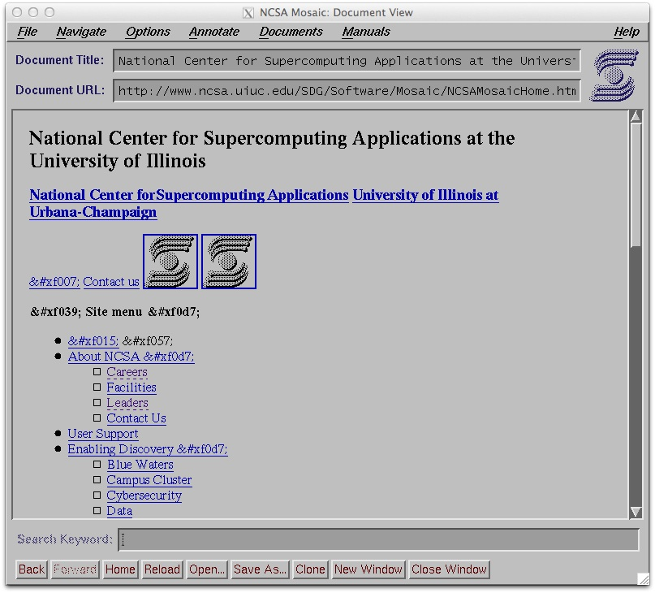

xmosaic-1.2
===========

A Place for me to play with XMosaic-1.2 - Mostly to try to get it to 
work on a Mac.

Pre-Requisites - Download and install OpenMotif from:

http://www.ist-inc.com/motif/download/index.html

It installs into /usr/OpenMotif

Of course you need X-Windows installed as well.

You can look at the NCSA README but here are the quick instructions.

    cd libwww
    make clean all
    cd ../libhtmlw
    make clean all
    cd ../src
    make clean all

From the src directory start xmosaic:

    ./xmosaic &

The problem you will have is that this browser talks
HTTP 1.0 and very few sites will respond to HTTP 1.0
requests.

